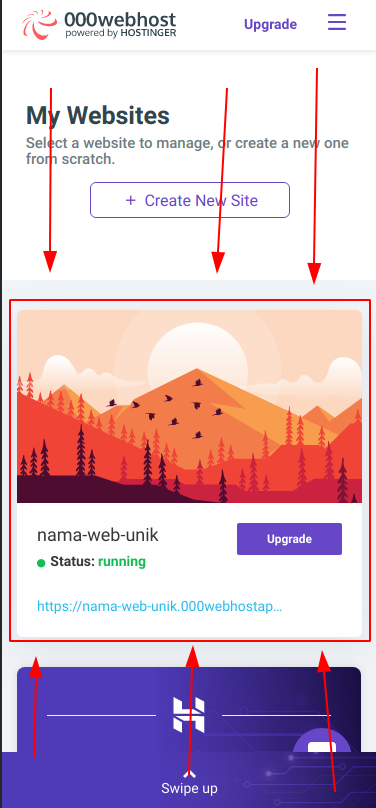

# 000webhost
Langkah-langkah membuat hosting web di 000webhost, mohon diikuti dengan benar.\

<!-- ## Syarat -->
<!-- - Akun 000webhost, jika belum punya, daftar di https://www.000webhost.com/free-website-sign-up, setelah daftar & verifikasi email, akun anda akan otomatis masuk ke 000webhost -->

## Langkah-langkah
1. Daftar di https://www.000webhost.com/free-website-sign-up\
  Setelah itu klik tombol dan anda akan diarahkan ke halaman ini :\
  \
2. Pembuatan proyek web awal
  Setelah itu klik tombol `Get Started`, lalu akan tampil seperti ini :\
  \
  klik tombol skip sampai di :\
  \
  pada tahap ini anda harus memasukkan nama web, jika gagal melanjut karena nama web sudah terpakai, cari nama web lain.\
  dalam contoh ini kita beri nama `nama-web-unik`, dan berhasil membuatnya.\
  setelah itu, pilih `Build Your Website Easily`\
  \
3. Pembuatan web
  Jika setelah itu anda keluar dari halaman secara tidak sengaja _(jika tidak mohon untuk lewati 2 langkah gambar di bawah ini)_, anda akan diarahkan ke halaman dashboard, dan pilih web sesuai nama yang ingin dimodifikasi :\
  \
  Lalu akan muncul tombol `Manage website`, dan klik tombol tersebut, dan akan tampil :
  \
  Setelah itu, pilih template yang anda inginkan\
  \
  Pilihan yang dikotak merah adalah kategori templatenya.\
4. Desain web
  Setelah anda memilih templatenya, aturlah desainnya dengan kreativitas anda!\
  Disarankan untuk menggunakan web dengan tampilan desktop, seperti laptop
